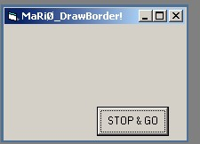



## DrawColorBorder to any window

### Description

draws a custom border to any window that you want (hwnd).Plz,opine
 
### More Info
 

             |
---                |---
**Submitted On**   |2003-06-20 02:35:02
**By**             |[MaRiØ G\. Serrano](https://github.com/Planet-Source-Code/PSCIndex/blob/master/ByAuthor/mari-g-serrano.md)
**Level**          |Intermediate
**User Rating**    |5.0 (10 globes from 2 users)
**Compatibility**  |VB 6\.0
**Category**       |[VB function enhancement](https://github.com/Planet-Source-Code/PSCIndex/blob/master/ByCategory/vb-function-enhancement__1-25.md)
**World**          |[Visual Basic](https://github.com/Planet-Source-Code/PSCIndex/blob/master/ByWorld/visual-basic.md)
**Archive File**   |[DrawColorB1603466202003\.zip](https://github.com/Planet-Source-Code/mari-g-serrano-drawcolorborder-to-any-window__1-46315/archive/master.zip)

